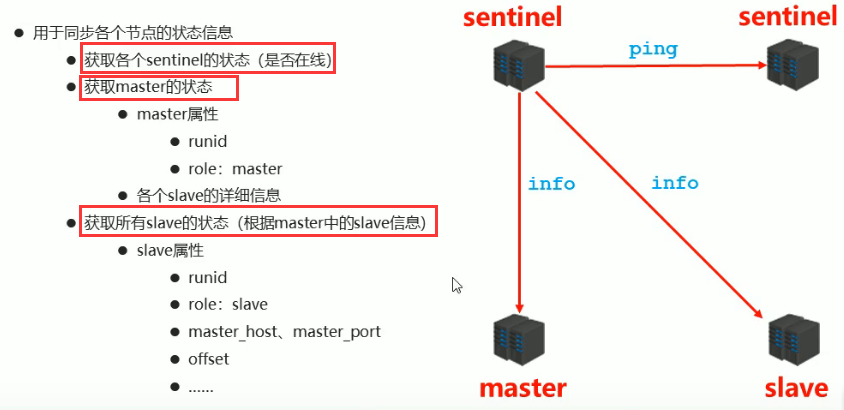
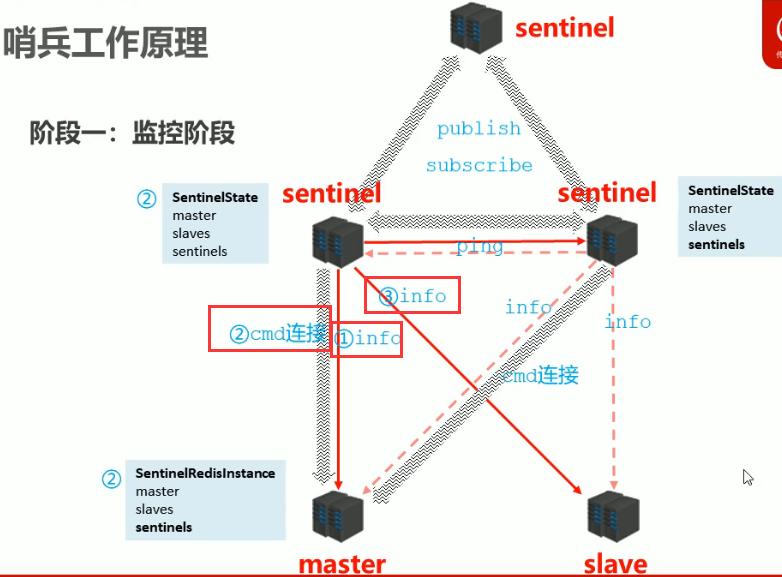
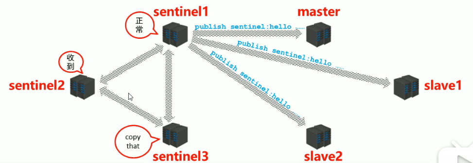
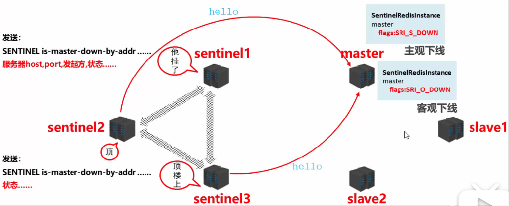
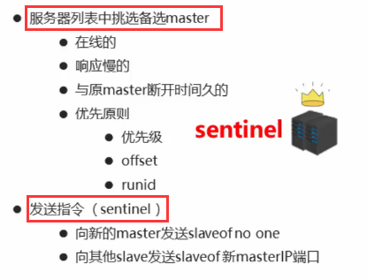

Redis入门到精通（二十）——哨兵概念、配置哨兵、哨兵工作原理（监控阶段、通知阶段、故障转移阶段） - 只会玩辅助 - 博客园

**哨兵概念**

哨兵是一个分布式系统，用于对主从结构中的每台服务器进行监控，当出现故障时通过投票机制选择新的master并将所有slave连接到新的master

**哨兵作用**

监控
不断的检查master和slave是否正常运行
master存活检测、master与slave运行情况检测

通知（提醒）
当被监控的服务器出现问题时，向其他（哨兵间，客户端）发送通知

自动故障转移
断开master与slave连接，选取一个slave作为master,将其他slave连接到新的master,并告知客户端新的服务器地址

**注意：哨兵也是一台redis服务器，只是不提供数据服务，通常哨兵配置数量为单数**

**一、配置哨兵**

配置一主两从的结构
配置三个哨兵（配置相同，端口不同）   参看sentinel.conf
启动哨兵
redis-sentinel sentinel-端口号.conf

**二、哨兵工作原理**

**1.阶段一：监控阶段**

** 监控步骤**

先启动主从服务器在启动哨兵 1.启动哨兵，连接上master之后发送info指令，获取master的信息 2.哨兵和master之间建立cmd连接方便发送指令，同时在哨兵端保存了所有信息包括master/slaves/sentinels,在master端也保存了所有信息包括master/slaves/sentinels 3.哨兵根据获得的slave信息去连接每一个slave,发送info指令获取slave详细信息 4.启动第二个哨兵也会自动去连接master,发送info指令，会发现master已经和其他哨兵连接过同时建立cmd连接，此时哨兵端保存信息包括master/slave/sentinels(包括之前连接的哨兵)，两个哨兵之间也会建立连接。 5.当第三个哨兵启动的时候，也会进行之前的操作

**2.阶段二：通知阶段**

**3.阶段三：故障转移阶段**

**故障转移流程**

1.其中一个sentinel向master发送信息，一段时间内master没有回应，标记状态SRI\_S\_DOWN(主观下线) 2.sentinel在自己内网中告诉其他哨兵，master挂了。其他哨兵也去连接master,半数以上的哨兵发现master挂了，那就是真的挂了，状态改成SRI\_O\_DOWN（客观下线） 3.所有的哨兵推选出一个哨兵领导，哨兵根据自己的原则从所有的slave中挑选出新的master,其他slave切换新的master,故障恢复后原master作为slave

**哨兵挑选新的master原则**

posted @ 2020-05-20 09:34  [只会玩辅助](https://www.cnblogs.com/wangcuican/)  阅读(333)  评论()  [编辑](https://i.cnblogs.com/EditPosts.aspx?postid=12921746)  收藏  举报