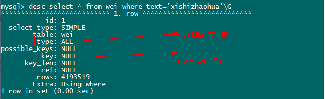

mysql开启慢SQL并分析原因

[沉默之声0619](https://blog.csdn.net/seelye) 2016-02-27 09:27:02 8267 收藏

## 第一步.开启mysql慢查询

## 方式一:修改配置文件

Windows：Windows 的配置文件为 my.ini，一般在 MySQL 的安装目录下或者 c:\\Windows 下。

Linux：Linux 的配置文件为 my.cnf ，一般在 /etc 下

在 my.ini 增加几行:

1.  \[mysqlld\]  
2.  long\_query\_time=2  

4.  #5.0、5.1等版本配置如下选项  
5.  log-slow-queries="mysql\_slow\_query.log"
6.  #5.5及以上版本配置如下选项  
7.  slow-query-log=On
8.  slow\_query\_log_file="mysql\_slow\_query.log"

10. log-query-not-using-indexes  

     第一句使用来定义查过多少秒的查询算是慢查询，我这里定义的是2秒

第二句使用来定义慢查询日志的路径（因为是windows，所以不牵涉权限问题）

第三句就是记录下没有使用索引的query

第二步：查看关于慢查询的状态

## 方式二:通过MySQL数据库开启慢查询

上文的配置需要重启mysql server进程mysqld才会生效。但是很多时候，尤其是产品运营环境，不希望每次修改都需要重新启动mysql服务器，也希望能在某些特定时间记 录。MySQL5.1给我们提供了更为灵活的运行时控制，使得你不必重新启动mysql服务器，也能选择性地记录或者不记录某些slow queries。

MySQL5.1中，提供了全局变量slow\_query\_log、slow\_query\_log\_file可以灵活地控制enable/disable慢查询。同时可以通过long\_query_time设置时间
#//启用slow query记录
#注意:设置了slow\_query\_log全局变量, log\_slow\_queries也会隐性地跟着改变
mysql>set global slow\_query\_log=ON

不幸运的是,在MySQL5.0并没有提供类似的全局变量来灵活控制，但是我们可以通过将long\_query\_time设置得足够大来避免记录某些查询语句。比如
mysql>set global long\_query\_time = 3600;

mysql>set global log\_querise\_not\_using\_indexes = ON;

MySQL5.0, 不关服务的情况下，希望不记录日志的办法是将日志文件成为/dev/null的符号链接(symbolic link)。注意:你只需要在改变后运行FLUSH LOGS以确定MYSQL释放当前的日志文件描述符，重新把日志记录到/dev/null

和MySQL5.0不同,MySQL5.1可以在运行时改变日记行为，将日志记录到数据库表中。只要将mysql全局变量log\_output设置为 TABLE即可。MySQL会将日志分别记录到表mysql.gengera\_log和mysql.slow_log二张表中。但是，我们推荐将日志记录 在日记文件中。
mysql> show variables like ‘log_output’\\G
Variable\_name: log\_output
Value: FILE
mysql>set global log_output=’table’;
缺陷与审记

虽然记录了slow query能够帮助你优化产品。但是MySQL目前版本，还有几大蹩足的地方。
1.MySQL5.0版本, long\_query\_time时间粒度不够细,最小值为1秒。对于高并发性能的网页脚本而言，1秒出现的意义不大。即出现1秒的查询比较少。直到mysql5.1.21才提供更细粒度的long\_query\_time设定.
2.不能将服务器执行的所有查询记录到慢速日志中。虽然MySQL普通日志记录了所有查询，但是它们是解析查询之前就记录下来了。这意味着普通日志没办法包含诸如执行时间，锁表时间，检查行数等信息。
3.如果开启了log\_queries\_not\_using\_indexes选项，slow query日志会充满过多的垃圾日志记录，这些快且高效的全表扫描查询(表小)会冲掉真正有用的slow queries记录。比如select * from category这样的查询也会被记录下来。

通过microslow-patch补丁可使用更细的时间粒度，和记录所有执行过的sql语句。不过，使用这个补订不得不自己编译MySQL，出于稳定性考滤，我们推荐在开发测试环境，可以打上这个补丁，享受这个补丁带来的便利。在运营环境尽量不要这么做…

##    第二步.验证慢查询是否开启

执行如下SQL语句来查看mysql慢查询的状态
执行结果会把是否开启慢查询、慢查询的秒数、慢查询日志等信息打印在屏幕上。

1.  /*查看慢查询时间 */  
2.  show variables like"long\_query\_time";默认10s  

4.  /*查看慢查询配置情况 */  
5.  show status like"%slow_queries%";  

7.  /*查看慢查询日志路径 */  
8.   show variables like"%slow%";  

## 第三步：执行一次慢查询操作

其实想要执行一次有实际意义的慢查询比较困难，因为在自己测试的时候，就算查询有20万条数据的海量表，也只需要0.几秒。我们可以通过如下语句代替：
SELECT SLEEP(10);
第四步：查看慢查询的数量
通过如下sql语句，来查看一共执行过几次慢查询：
show global status like '%slow%';

mysql日志的配置：

1.  注意：这些日文件在mysql重启的时候才会生成  
2.  #记录所有sql语句  
3.  log=E:/mysqllog/mysql.log  

5.  #记录数据库启动关闭信息，以及运行过程中产生的错误信息  
6.  log-error=E:/mysqllog/myerror.log  

8.  # 记录除select语句之外的所有sql语句到日志中，可以用来恢复数据文件  
9.  log-bin=E:/mysqllog/bin  

11. #记录查询慢的sql语句  
12. log-slow-queries=E:/mysqllog/slow.log    

14. #慢查询时间  
15. long\_query\_time=2  

##    第四步:分析慢查询日志

## 方式一:通过工具分析

MySQL自带了mysqldumpslow工具用来分析slow query日志，除此之外，还有一些好用的开源工具。比如MyProfi(下载地址:http://sourceforge.net/projects/myprofi/)、mysql-log-filter，当然还有mysqlsla

以下是mysqldumpslow常用参数说明，详细的可应用mysqldumpslow -help查询。

    -s，是表示按照何种方式排序，c、t、l、r分别是按照记录次数、时间、查询时间、返回的记录数来排序（从大到小），ac、at、al、ar表示相应的倒叙。 
-t，是top n的意思，即为返回前面多少条数据。
-g，后边可以写一个正则匹配模式，大小写不敏感。

接下来就是用mysql自带的慢查询工具mysqldumpslow分析了（mysql的bin目录下），我这里的日志文件名字是host-slow.log。

列出记录次数最多的10个sql语句

mysqldumpslow -s c -t 10 host-slow.log

列出返回记录集最多的10个sql语句

mysqldumpslow -s r -t 10 host-slow.log

按照时间返回前10条里面含有左连接的sql语句

mysqldumpslow -s t -t 10 -g "left join" host-slow.log

使用mysqldumpslow命令可以非常明确的得到各种我们需要的查询语句，对MySQL查询语句的监控、分析、优化起到非常大的帮助。

## 方式二:直接分析mysql慢查询日志

日志部分内容如下:

\# Time: 121017 17:38:54 
\# User@Host: root\[root\] @ localhost \[127.0.0.1\] 
# Query_time: 3.794217 Lock\_time: 0.000000 Rows\_sent: 1  Rows_examined: 4194304
SET timestamp=1350466734; 
select * from wei where text='orange';
\# Time: 121017 17:46:22 
\# User@Host: root\[root\] @ localhost \[127.0.0.1\] 
# Query_time: 3.819219  Lock\_time: 0.000000 Rows\_sent: 0  Rows_examined: 4194304
SET timestamp=1350467182; 
select * from wei where text='xishizhaohua';

其实定位到了慢查询语句就已经完成了一大不了，执行explain或者desc命令查看慢查询语句，如下图：

问题很明显，解决方式也很明显，建索引了。

1.  mysql> createindex text_index on wei(text);    
2.  Query OK, 4194304 rows affected (1 min 58.07 sec)    
3.  Records: 4194304  Duplicates: 0  Warnings: 0  

然后在执行查询操作，用时明显少了很多。

1.  mysql> select * from wei where text='orange';  
2.  +
3.  | id      | text   |  
4.  +
5.  | 4103519 | orange |  
6.  +
7.  1 row inset (0.33 sec)  

Slow Query日志，虽然帮助你记录了那些执行过了的SQL语句。但它不是万能的，意义可能没有你想象的那么大。它只告诉了你哪些语句慢，但是为什么慢?具体 原因，还是需要你自己去分析，不断的调试。也许，你只需要换一条更有效的sql语句，也许你只需简单地增加一个索引，但也有可能你需要调整你应用程序的设 计方案。比如，上面那条语句是很明显，它检查了600多万行数据。不幸的是，并不是每条语句都这么明显。也许还有别的原因，比如:
*锁表了，导致查询处于等态状态。lock_time显示了查询等待锁被翻译的时间
*数据或索引没有被缓存。常见于第一次启动服务器或者服务器没有调优
*备份数据库，I/O变慢
*也许同时运行了其它的查询，减少了当前查询

所以,不要过于紧张日志文件某条记录，而应该理性地审记，找出真正的原因。如果经常出现的slow query需要特别注意。如果个别出现，则做一些常规检查即可。我们建议，统计并且形成基准报告，进行比较排除，比胡乱瞎撞有用。希望大家不要在这部分过于浪费时间与精力。